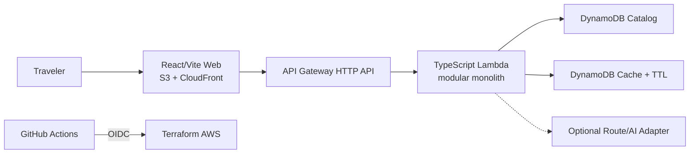

# Japan-Korea Travel Route Composer

[한국어](README.md) | [日本語](README.ja.md) | [English](README.en.md)

> Status: Sol phased design complete; Luna implementation handoff READY
>
> LUN-015 status: Budget inputs approved and configured; Production Apply `31932494722` partially applied then stopped because the Deploy Role IAM policy was incomplete; State recovery confirmed that the Lambda inline policy was not yet created and is being remediated
>
> Implementation: LUN-001~013 application/infrastructure and LUN-014 Source Governance Gate,
> Projection Build, DynamoDB Catalog Publisher, and Catalog Rollback implemented; 160 OSM-based
> catalog places imported (80 Tokyo, 80 Seoul) and the Production Projection built; the AWS IAM
> Identity Center project user and temporary Bootstrap permission are connected; Bootstrap State/Artifact
> buckets, OIDC, and Plan/Deploy Roles are confirmed in the account; immutable OIDC Trust and the GitHub
> Terraform Plan verification are complete, Deploy Role policy and Production State recovery workflows have been added, and application deployment remains incomplete
> Production workflow `31932494722` passed Build, verification, artifact creation, OIDC, and Lambda artifact upload to S3 for the reviewed commit, but Terraform Apply stopped because the Deploy Role lacked `iam:ListRolePolicies` and CloudWatch Alarm permissions; parts of S3 Web, CloudFront, DynamoDB, SNS, Budget, and Log Group were created, while API/Web publishing and Smoke did not run
> Terraform Plan `31927331676` passed OIDC and state initialization, then stopped on the unapproved empty `BUDGET_EMAIL` validation; no Apply, artifact upload, or deployment ran
> Plan, Deploy, and Teardown workflows now preflight the Budget Secret, approved monthly budget, and immutable Lambda artifact variables before OIDC; the approved Budget Secret and monthly budget of `1 USD` were configured for this run
> Latest manual Terraform Plan `31929552323` stopped at the `BUDGET_EMAIL` preflight at that time; the later Production workflow reached OIDC and artifact upload
> Latest GitHub CI `31929411509` passed quality, browser-e2e, terraform-static, and all contract checks; this run did not include AWS OIDC or Terraform Apply
> State reconcile `31933697630` stopped while importing existing resources because the Lambda inline policy was not yet present; the recovery script now imports that policy only when it exists, and 9 contract tests passed
> The follow-up State reconcile `31933964803` stopped because the Budget SNS email subscription was `PendingConfirmation`; unconfirmed subscriptions are not ARNs, so recovery now skips them until the email is confirmed
> Production run `31934294917` passed Build, OIDC, and artifact upload, then stopped when Terraform calculated `30 to add, 0 to change, 0 to destroy` and collided with existing resources; the cause was the missing production backend declaration, so an S3 backend declaration was added before retrying State recovery
> After adding the backend declaration, Terraform `1.9.8` failed because it does not support `use_lockfile`; all Terraform executions are now pinned to `1.10.5` before revalidating State recovery
> Production run `31934959968` read the remote State and reached `15 to add, 2 to change, 0 to destroy`, then Lambda creation stopped because this AWS account requires at least 10 unreserved concurrency; the Production workflow must explicitly disable concurrency management
> Follow-up run `31935488510` stopped when a Lambda left tainted by the prior failed apply was recreated and returned `Function already exist`; recovery now untaints the Lambda address and preserves the existing function without deletion
> State reconcile `31935919549` found the Lambda function but stopped when it attempted to import the Lambda permission without an `AllowHttpApiInvoke` statement; recovery now imports that permission only when the statement exists in the actual resource policy, and will be revalidated
> Production deploy `31936300645` completed Terraform Apply (`9 added, 1 changed, 0 destroyed`, including the API endpoint and CloudFront domain) but stopped because the Catalog publisher's Docker container did not receive the OIDC session credentials needed to read remote Terraform outputs; the container environment forwarding will be fixed before rerunning Catalog/Web/Smoke
> Rerun `31936509852` completed Apply (`0 added, 1 changed, 0 destroyed`) but stopped before Catalog publish because the Lambda package could not resolve the AWS SDK nested dependency `@aws-sdk/core/account-id-endpoint`; the Build packaging now uses `node-linker=hoisted` before revalidation
> The subsequent real default Compose request returned `No publishable candidate is available.` because the OSM selector had published cafes only with `UNKNOWN` opening status; ingestion selection, the Production Gate, and an actual Compose smoke check were fixed, and the corrected Release has not yet been redeployed
> Release `31937854878` stopped before AWS because Checkout received a short `release_sha`; full-SHA rerun `31937906488` reached the Build Gate but stopped because 323 generated Catalog JSON files differed from Prettier; the importer output is now fixed before redeployment
>
> Public URL and user metrics: none
>
> LUN-014 verification: format, lint, typecheck, 67 Vitest tests, 4 smoke contract tests, 5 release
> contract tests, 5 workflow contract tests, 4 Terraform contract tests, 4 browser E2E tests, build,
> catalog:validate, catalog:build, and dependency audit passed; Terraform fmt/validate, TFLint, and
> Trivy passed in the preceding CI; the Production Catalog validate/build and OSM Source Gate passed
> (2026-08-16; source checksum `6d0d9bd96a3ff7a753fdcafe093c2967a2086f525a764790e69280a9a552f6ea`; projection checksum
> `6d23621e5c3ec835c47cb40beda6d8408803e54a3e15381451b36aebe15c440a`)
>
> GitHub CI verification: quality, browser-e2e,
> terraform-static, Smoke contract tests, Release contract tests, Workflow contract tests, and
> Terraform contract tests all passed
> ([latest run result](https://github.com/ekseh93/japan-korea-travel-route-composer/actions/runs/31929411509),
> 2026-08-16)

## Project Overview

This non-commercial employment portfolio composes a feasible Tokyo or Seoul itinerary after the user
enters trip length, arrival and departure times, interests, companions, budget, and walking
tolerance, then presses `Compose`. The result includes place order, visit and travel time,
recommendation reasons, official facts, evidence quality, and verifiable sources.

## Problem and Users

Travelers must check recommendations, first-hand experiences, opening hours, and directions across
several services and assemble a daily plan themselves. This project targets first-time solo, friend,
couple, and family travelers with an explainable route that honors constraints instead of a long
place list.

## MVP Scope

- Regions: Tokyo and Seoul
- Duration: one to four nights, or two to five days
- Inputs: time, themes, companions, budget, pace, walking, required/excluded places, rain
  consideration
- Results: daily visits, travel segments, breaks, reasons, sources and checked dates, indoor
  alternatives
- Data: official APIs, public/open data, manually verified links, and original summaries
- Excluded: login, payment/booking, ads/affiliates, user reviews, nationwide search, live weather

## Key Design Decisions

| Area             | Decision                                   | Rationale                                                    |
| ---------------- | ------------------------------------------ | ------------------------------------------------------------ |
| Language and Web | TypeScript, React, Vite                    | One language for Web, API, and schemas; static deployment    |
| Domain           | DDD modular monolith                       | Explicit boundaries with solo-operator deployment simplicity |
| API              | API Gateway HTTP API + Lambda              | Avoid idle fixed cost and server operations                  |
| Data             | Git-reviewed source + DynamoDB projection  | Immutable catalog versions and key-based reads               |
| Hosting          | Private S3 + CloudFront OAC                | Explicit Terraform, IAM, and caching boundaries              |
| Map and routing  | MapLibre/OpenFreeMap + curated zone matrix | Zero-cost baseline and provider failure degradation          |
| AI               | Disabled by default; intent and prose only | Prevent invented places, times, and citations                |

## Architecture



Trip Composition is the core domain. Place Catalog, Evidence Governance, Routing, and Curation
remain code boundaries in one deployable unit. The MVP does not add artificial microservices, an
event bus, or always-on servers.

## Recommendation and Source Policy

AI does not own recommendations. Hard filters, a 100-point fit score, zone clustering, a travel-time
matrix, opening and visit windows, and beam search compose the route. Identical input,
CatalogVersion, AlgorithmVersion, and DiversitySeed produce the same result; regeneration varies
only among valid high-ranking plans.

Attribution is not permission. Review text, photos, and user information are not crawled or copied.
Triple and reviewed communities remain BLOCKED or UNVERIFIED without a valid permission basis. Every
public recommendation requires official, open, or licensed Tier A/B evidence.

## AWS Cost and Security

The operating-cost target is USD 0 per month, but AWS Free Tier varies by account, period, and
service and cannot guarantee zero cost. The design includes USD 1 and USD 5 budget alerts, an API
limit of one request per second, Lambda concurrency of one, seven-day logs, disabled paid providers,
and full teardown.

GitHub Actions uses short-lived AWS OIDC credentials with separate Plan and Deploy roles; long-lived
access keys are prohibited. NAT Gateway, RDS, ECS, OpenSearch, WAF, paid domains, and persistent
staging are excluded by default.

## Delivery and Quality

Pull requests must pass formatting, linting, type checks, domain property tests, Golden
Recommendation fixtures, source-rights gates, accessible E2E tests, and Terraform security checks.
Production apply requires protected-environment approval and immutable artifacts from the same
commit. LUN-001 covers the workspace, unit tests, and local build, and LUN-002 adds executable
API/Domain Catalog contracts and contract tests, and LUN-003 domain value objects and TripPlan
invariants. LUN-004 adds synthetic fixtures and Golden inputs; LUN-005 adds
Source/Evidence/Place/Route schema and rights validation; LUN-006 adds in-memory and DynamoDB
Catalog/Cache adapters with TTL contract tests; LUN-007 adds Zone Matrix, Haversine, and fallback
routing adapters with failure contract tests; LUN-008 adds deterministic candidate scoring, zone
limits, bounded beam scheduling, time windows, Must/Exclude handling, and rain alternatives; LUN-009
adds a pure HTTP Handler with contract-based error mapping; LUN-010 adds the responsive input,
result, and source Web UI; LUN-011 adds the optional MapLibre/OpenFreeMap map and tile-failure
degradation. Terraform cost/observability controls and the LUN-013 Build once OIDC workflow are
implemented. The protected deploy job consumes Web/Lambda artifacts, checksums, and SBOMs produced
from the same commit. Terraform fmt/validate, TFLint, Trivy, and the quality/browser-e2e workflows
ran in GitHub CI. LUN-014 adds deterministic `asOf` checks for BLOCKED/UNVERIFIED Source references,
expired Source/Evidence, unregistered Source hosts, missing Production Route SourceRefs, and
MANUAL_LINK_ONLY/Tier mismatches with contract tests. The Bootstrap Terraform plan and partial apply ran.
After the GitHub OIDC subject was fixed to the immutable owner/repository ID format, final run `31925069545`
passed both OIDC AssumeRole and Terraform Plan; Production deploy `31936843773` verified artifact
upload, Lambda/API Gateway integration, deployment, and Catalog publish. The
LUN-014 Source Gate also enforces a Production catalog size of 150-250 published Places in total and
at least 75 per city. The Projection Build tooling builds a canonical Projection from validated Seed
data, injects catalog metadata and city statistics, computes a source and final SHA-256 checksum,
and excludes internal Source review notes from the public Projection. The tooling converts Seed
records into the shared `publishedPlaceSchema` and public Evidence shape, retaining only provider,
attribution, and checked-date fields needed at runtime. Synthetic fixtures are allowed only for
tests and are rejected in Production mode. The local pointer contract now creates candidates only
from a validated Projection and rejects stale Version promotion. The DynamoDB Catalog Publisher
conditionally reserves both city META items before writing the validated Projection to Version
partitions with bounded retries, then promotes both city Current pointers in one transaction with
expected-previous-Version conditions. The Production Workflow invokes the publisher CLI immediately
after apply, and Production deploy `31936843773` passed real AWS Catalog publish, Web publish, and
API/Web Smoke. The protected rollback Workflow conditionally restores existing Catalog pointers, but
rollback itself has not run. Production Terraform workflows now pass the approved State bucket, fixed state key, and lockfile
backend; the MapLibre renderer is lazy-loaded on the
result view, separating the initial Web entry from the optional map chunk; the local build completed
without a chunk warning.

## Current Status

| Item                                                 | Status                                                                                                                                                                                                                                                                                                                                                                                                                                                                                             |
| ---------------------------------------------------- | -------------------------------------------------------------------------------------------------------------------------------------------------------------------------------------------------------------------------------------------------------------------------------------------------------------------------------------------------------------------------------------------------------------------------------------------------------------------------------------------------- |
| Company-style requirements definition                | v1.0 BASELINED                                                                                                                                                                                                                                                                                                                                                                                                                                                                                     |
| Product, UX, DDD, AWS, data, and delivery design     | Phase Gate validation complete                                                                                                                                                                                                                                                                                                                                                                                                                                                                     |
| Application and infrastructure code                  | LUN-001~013 workspace, contracts, domain, synthetic fixtures, rights validation, repository, routing, Compose, HTTP API, travel UX, resilient map enhancement, Terraform cost/observability controls, Build once OIDC workflow, and LUN-014 Source Governance Gate, Projection Build, DynamoDB Catalog Publisher, and Catalog Rollback implemented; OSM catalog and Projection built and the Production AWS stack applied                                                                          |
| Real catalog of 150-250 places                       | 160 OSM-based places imported and Production Gate passed; source checksum `6d0d9bd96a3ff7a753fdcafe093c2967a2086f525a764790e69280a9a552f6ea`; projection checksum `6d23621e5c3ec835c47cb40beda6d8408803e54a3e15381451b36aebe15c440a`                                                                                                                                                                                                                                                               |
| Tests and builds                                     | LUN-001~014 Gate format, lint, typecheck, 67 Vitest tests, 4 smoke contract tests, 5 release contract tests, 5 workflow contract tests, 4 Terraform contract tests, 4 browser E2E tests, build, catalog:validate, catalog:build, frozen install, and dependency audit run; hoisted production package validation and protected Build Gate `31925830262` passed, Terraform fmt/validate, TFLint, and Trivy passed, and Production deploy `31936843773` passed Catalog/Web publish and API/Web Smoke |
| AWS resources and deployment URL                     | State/Artifact buckets, GitHub OIDC Provider, Plan/Deploy Roles, Lambda, API Gateway, DynamoDB, S3, CloudFront, Budget, SNS, and CloudWatch applied in `ap-northeast-1`; Web [https://d2r0admgel5eik.cloudfront.net/](https://d2r0admgel5eik.cloudfront.net/), API `https://o37ec3iu55.execute-api.ap-northeast-1.amazonaws.com`                                                                                                                                                                   |
| Measured performance, availability, and user metrics | None                                                                                                                                                                                                                                                                                                                                                                                                                                                                                               |

## Design Documents

- [Sol Phase Gates](docs/00-governance/SOL_PHASE_GATES.md),
  [requirements traceability](docs/00-governance/REQUIREMENTS_TRACEABILITY_MATRIX.md),
  [document register](docs/00-governance/DOCUMENT_REGISTER.md)
- [LUN-015 approval checklist](docs/08-handoff/LUN015_APPROVAL_CHECKLIST.md)
- [Product requirements](docs/01-product/PRD.md),
  [business and system requirements definition](docs/01-product/REQUIREMENTS_DEFINITION.md),
  [requirements specification](docs/01-product/REQUIREMENTS.md),
  [glossary](docs/01-product/GLOSSARY.md)
- [UX specification](docs/02-ux/UX_SPEC.md), [responsive wireframes](docs/02-ux/WIREFRAMES.md),
  [information architecture](docs/02-ux/INFORMATION_ARCHITECTURE.md)
- [DDD design](docs/03-domain/DDD.md)
- [AWS architecture](docs/04-architecture/ARCHITECTURE.md),
  [API contract](docs/04-architecture/API_CONTRACT.md),
  [security](docs/04-architecture/SECURITY.md), [ADRs](docs/04-architecture/ADRs/)
- [Data model](docs/05-data/DATA_MODEL.md), [Domain Catalog](docs/05-data/DOMAIN_CATALOG.md),
  [seed specification](docs/05-data/SEED_SPEC.md), [source policy](docs/05-data/SOURCE_POLICY.md),
  [Source Registry](docs/05-data/SOURCE_REGISTRY.md),
  [recommendation engine](docs/05-data/RECOMMENDATION.md)
- [Terraform](docs/06-infrastructure/TERRAFORM.md),
  [cost model](docs/06-infrastructure/COST_MODEL.md), [runbook](docs/06-infrastructure/RUNBOOK.md),
  [AWS and GitHub authentication troubleshooting](docs/06-infrastructure/TROUBLESHOOTING.md)
- [CI/CD](docs/07-delivery/CI_CD.md), [testing](docs/07-delivery/TEST_STRATEGY.md),
  [observability](docs/07-delivery/OBSERVABILITY.md)
- [Luna implementation handoff](docs/08-handoff/LUNA_HANDOFF.md),
  [Luna new-task context](docs/08-handoff/LUNA_INITIAL_CONTEXT.md)
- [Implementation update log](docs/08-handoff/IMPLEMENTATION_LOG.md)

## Local Development and Deployment

LUN-001~014 provide a Vite development server and the following local verification commands. It uses
the Node.js 24 LTS line (`>=24.18.0 <25`) and pnpm 11 (`11.19.0`).

```text
pnpm install --frozen-lockfile
pnpm dev
pnpm format:check
pnpm lint
pnpm typecheck
pnpm test
pnpm test:e2e
pnpm build
pnpm catalog:import:osm
pnpm catalog:validate
pnpm catalog:validate --as-of 2026-08-16
pnpm catalog:validate --root data/catalog-v1 --production --as-of 2026-08-16
pnpm catalog:build
pnpm catalog:build -- --root data/catalog-v1 --production --as-of 2026-08-16 --catalog-version catalog-osm-20260816 --output release/catalog-projection.json
pnpm workflow:verify:test
pnpm terraform:contract:test
pnpm smoke:test
pnpm smoke -- --base-url https://<web-host> --api-base-url https://<api-host>
pnpm audit --audit-level high
```

The Web accepts city, duration, time windows, locale, pace, companion, and rain preferences, then
displays daily visits, travel time, reasons, and Evidence links from the Compose API. Set
`VITE_API_BASE_URL` for the local HTTP API; synthetic fixtures are test-only. Production deployment is
blocked at Terraform input validation when the approved `BUDGET_EMAIL` Secret or monthly budget input is missing or malformed.
The Production Catalog contains 160 OSM-based places and Evidence records. Pure HTTP Handler contract tests, 4 local HTTP smoke contract tests, 3 Terraform
cost/security boundary contract tests, and 4 browser accessibility/responsive/map-degradation E2E
tests ran. Production deploy `31936843773` verified the real Lambda/API Gateway integration and
deployment URL smoke. The Catalog Publisher is a deployment-workflow component that requires the
immutable artifact and AWS credentials; it has not called AWS locally.

## Roadmap

1. Implement and verify the LUN-001~014 TypeScript monorepo, quality foundation, executable
   contracts, domain foundation, synthetic fixtures, rights validator, repository, routing, Compose,
   HTTP API, Web adapters, Terraform, CI, Source Governance Gate, Projection Build, Catalog
   Publisher, and Rollback
2. Import 160 places from the approved OSM Source in Tokyo and Seoul; Production Gate verification complete
3. AWS account, budget, and OIDC verified; deploy and smoke verification complete, rollback verification pending
4. Re-evaluate city expansion and optional route/AI adapters from real feedback

## License and Purpose

This is a personal, non-profit, non-commercial employment portfolio with no sales, advertising,
payments, or affiliate revenue. No source-code license has been selected, so reuse permission is not
granted until a separate LICENSE is added. External data, maps, and links remain subject to provider
terms, licenses, and attribution requirements.

## Implementation Handoff

Requirements, UX, DDD, architecture, data, and delivery design passed their Phase Gates. The OSM-based
catalog and Production Projection are built, Bootstrap resources are confirmed, and GitHub OIDC/Plan
verification is complete. Protected Production deploy `31936843773` applied the immutable Release
Artifact and passed public URL smoke verification.

`LUNA HANDOFF: READY`
