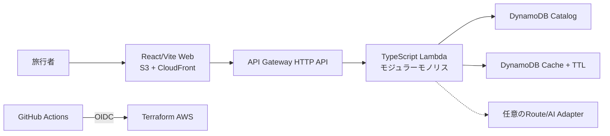

# 日韓旅行ルートコンポーザー

[한국어](README.md) | [日本語](README.ja.md) | [English](README.en.md)

> 状態: Solの段階別設計完了、Luna実装引継ぎREADY
>
> LUN-015状態: Budget入力の承認・登録は完了、Production Apply `31932494722`はDeploy Role IAMポリシー不足で部分適用後に停止、State復旧はLambdaインラインポリシーが未作成であることを確認して修正中
>
> 実装状態: LUN-001~013のアプリケーション・インフラとLUN-014 Source Governance Gate・Projection
> Build・DynamoDB Catalog Publisher・Catalog Rollbackを実装、OSMベースのCatalog 160件(東京80・ソウル80)を
> 取込・Production Projection生成済み、AWS IAM Identity Centerのプロジェクトユーザーと一時Bootstrap権限の接続は完了、
> BootstrapのState/Artifact Bucket・OIDC・Plan/Deploy Roleはアカウントで確認済み、immutable OIDC TrustとGitHub Terraform Planの検証は完了、Deploy Roleポリシー・Production State復旧workflowを追加し、Production配信とSmokeは`31936843773`で完了
> Production workflow `31932494722`は現行review commitでBuild・検証・artifact生成・OIDC・Lambda artifactのS3アップロードまで成功したが、Terraform Apply中にDeploy Roleの`iam:ListRolePolicies`とCloudWatch Alarm権限不足で停止、S3 Web・CloudFront・DynamoDB・SNS・Budget・Log Groupの一部は作成済み、API/Web公開・Smokeは未実行
> Terraform Plan `31927331676`はOIDC・State initまで成功した後、未承認で空の`BUDGET_EMAIL` validationにより停止、Apply・artifact upload・配信は未実行
> その後、Plan・Deploy・Teardown workflowにBudget Secret・月額予算変数とimmutable Lambda artifact変数の事前検査をOIDC前に追加し、今回の実行で承認済みBudget Secretと月額予算`1 USD`を登録
> 最新の手動Terraform Plan `31929552323`は当時`BUDGET_EMAIL`事前検査で停止したが、その後のProduction workflowではOIDCとartifactアップロードまで成功
> 最新のGitHub CI `31929411509`でquality・browser-e2e・terraform-staticと全契約テストが成功、AWS OIDC・Terraform Applyは含まれていない
> State reconcile `31933697630`は既存リソースのimport中にLambdaインラインポリシーが未作成で停止、ポリシーが存在する場合だけimportするよう復旧スクリプトを修正し、契約テスト9件に合格
> 続くState reconcile `31933964803`はBudget SNSメール購読が`PendingConfirmation`の状態で停止、未確認購読はARNではないためimportせず、メール確認後に再検証するよう修正中
> Production run `31934294917`はBuild・OIDC・artifact uploadまで成功した後、Terraformが`30 to add, 0 to change, 0 to destroy`を計画し、既存リソース作成競合で停止、production backend宣言の欠落が原因と確認したためS3 backend宣言を追加してState復旧を再実行する
> backend宣言後、Terraform `1.9.8`が`use_lockfile`をサポートしないエラーを確認、すべてのTerraform実行を固定`1.10.5`へ更新し、修正commitでState復旧を再検証する
> Production run `31934959968`はRemote Stateを読み`15 to add, 2 to change, 0 to destroy`まで進んだが、AWSアカウントのunreserved concurrency最小10制約でLambda作成が停止、Production workflowでconcurrency管理を明示的に無効化する修正が必要
> 続くrun `31935488510`は前回失敗でtaintedになったLambdaを再作成しようとして`Function already exist`で停止、既存Functionを削除せずState復旧でLambdaアドレスをuntaintして現在のFunctionを維持するよう修正
> State reconcile `31935919549`は既存Lambda Functionを確認したが`AllowHttpApiInvoke`権限ステートメントがない状態でLambda permissionをimportしようとして停止、実際のresource policyに該当ステートメントがある場合だけimportするよう修正して再検証する
> Production deploy `31936300645`はTerraform Applyまで成功(`9 added, 1 changed, 0 destroyed`、API endpoint・CloudFront domainを作成)したが、Catalog publisherがRemote Terraform outputを取得するDockerコンテナへOIDC一時認証情報を渡しておらず停止、コンテナ環境変数の引き渡しを修正してCatalog/Web/Smokeを再実行する
> 再実行 `31936509852`はApplyまで成功(`0 added, 1 changed, 0 destroyed`)したが、Lambda配布パッケージでAWS SDKの依存関係`@aws-sdk/core/account-id-endpoint`を解決できずCatalog publish前に停止、Buildで`node-linker=hoisted`を使うよう修正して再検証する
> その後、実際の初期Composeリクエストで`No publishable candidate is available.`を確認、原因はカフェだけを選択したOSM Catalogと`UNKNOWN`営業時間だったため、取込選別・Production Gate・実Compose Smokeを修正し、修正版Releaseの再配信前である
> 修正版Release `31937854878`は短い`release_sha`でCheckoutを試みAWS段階前に停止、全SHAで再実行した`31937906488`は新しいCatalog JSON 323件とPrettier形式の差でBuild Gate停止、Importerの出力形式を固定して再配信準備中
> 全SHA `5649d4ac79781640be8159c0c21ee7353529e22b`のdeploy `31938026813`はBuildとTerraform plan/applyまで成功したが、Catalog publishのimmutable Version予約条件で停止、既存Current Versionを指定した再実行`31938276531`も前回実行が残した同じVersion予約で停止した
> 予約済み`catalog-5649d4ac79781640be8159c0c21ee7353529e22b`は手動削除せず廃棄対象として記録し、新しい文書commit SHAでCatalog/Web/実Compose Smokeを再実行予定
> 文書commitベースのdeploy `31938592591`はBuild・保護Environment承認・OIDC・Terraform Apply・新Catalog Version昇格・Web公開まで成功したが、HTTP応答の`dayPlans`ではなく存在しない`plan`を検査するSmoke契約エラーで失敗、Workflowを`dayPlans`検査へ修正して再検証予定
>
> 公開URL・ユーザー指標: なし
>
> LUN-014検証: format・lint・typecheck・69
> Vitestテスト・Smoke契約4件・Release契約5件・Workflow契約6件・Terraform契約4件・ブラウザE2E
> 4件・build・catalog:validate・catalog:build・依存関係監査に合格、Terraform
> fmt/validate・TFLint・Trivyは直前のCIで合格、ローカルのProduction Catalog validate/buildとlegacy package deployには合格、保護されたBuild Gate `31925830262`はcatalog・package・checksum・SBOM・GitHub artifact uploadに合格
> (2026-08-16、Source checksum `5b580a04a5955d7101663126ce9b2ac4dd1cf7306c7a48c2ee43030f92756896`、Projection checksum
> `745651044bfb8345cb44778985cb91625e9754794be62955fd787d9d4645afd6`)
>
> GitHub CI検証:
> quality・browser-e2e・terraform-static、Smoke contract tests、Release contract tests、Workflow
> contract tests、Terraform contract
> testsに合格 ([最新の実行結果](https://github.com/ekseh93/japan-korea-travel-route-composer/actions/runs/31929411509)、2026-08-16)

## プロジェクト概要

旅行期間、到着・出発時刻、興味、同行者、予算、徒歩許容度を入力し、
`組み合わせる`を押すと、東京またはソウルの実行可能な日別ルートを構成する非営利の就職ポートフォリオです。場所の順序、滞在・移動時間、推薦理由、公式情報、Evidence品質、確認可能な出典を同時に表示します。

## 課題とユーザー

旅行者は場所の推薦、実体験、営業時間、経路を複数サービスで確認し、自分で一日の旅程に組み立てる必要があります。本プロジェクトは初訪問の一人旅、友人、カップル、家族に対し、`大量の場所一覧`ではなく制約を守る説明可能なルートを提供します。

## MVPスコープ

- 地域: 東京、ソウル
- 期間: 1～4泊、つまり2～5日
- 条件: 時刻、テーマ、同行者、予算、ペース、徒歩量、必須・除外場所、雨天考慮
- 結果: 日別Visit、移動区間、休憩、推薦理由、出典・確認日、屋内代替候補
- データ: 公式API、公共・オープンデータ、手動確認リンク、独自要約
- 対象外: ログイン、決済・予約、広告・提携、ユーザーレビュー、全国検索、リアルタイム天気

## 主要な設計判断

| 領域       | 決定                                    | 理由                                   |
| ---------- | --------------------------------------- | -------------------------------------- |
| 言語・Web  | TypeScript、React、Vite                 | Web・API・Schemaの単一言語と静的配信   |
| Domain     | DDDモジュラーモノリス                   | 明確な境界と個人運用に適した配信単純性 |
| API        | API Gateway HTTP API + Lambda           | アイドル固定費とサーバー運用を回避     |
| データ     | Git審査原本 + DynamoDB公開Projection    | 不変CatalogVersionとキー検索           |
| Hosting    | 非公開S3 + CloudFront OAC               | Terraform、IAM、Cache境界を直接説明    |
| 地図・経路 | MapLibre/OpenFreeMap + 審査済みZone行列 | 無料の基本経路とProvider障害縮退       |
| AI         | 初期無効、意図解析・説明のみ            | 場所・時刻・出典の任意生成を防止       |

## アーキテクチャ



Trip Compositionを中核Domainとし、Place Catalog、Evidence
Governance、Routing、Curationを同じデプロイ単位のコード境界として維持します。不要なMicroservice、Event
Bus、常時稼働Serverは作りません。

## 推薦と出典ポリシー

推薦はAIではなく、ハードフィルター、100点適合度、Zoneクラスタリング、移動時間行列、営業時間・滞在時間、Beam
Searchで計算します。同じ入力、CatalogVersion、AlgorithmVersion、DiversitySeedは同じ結果を生成し、新しい組み合わせも有効な上位候補内でのみ変化します。

出典表示は利用許諾ではありません。レビュー本文・写真・ユーザー情報をクロール・複製しません。Tripleと確認対象のコミュニティは根拠がなければBLOCKEDまたはUNVERIFIEDとし、公開推薦には公式・公共・許諾済みEvidence
Tier A/Bを必須とします。

## AWSコストとセキュリティ

目標運用費は月0 USDですが、AWS Free
Tierはアカウント・期間・サービス条件で異なり、0円を保証しません。1 USD・5 USD Budget通知、API 1
request/second、Lambda同時実行1、7日ログ、外部有料Provider初期無効、全撤去手順を設計しました。

GitHub ActionsはAWS OIDC短期認証とPlan/Deploy Role分離を使い、長期Access Keyを禁止します。NAT
Gateway、RDS、ECS、OpenSearch、WAF、有料Domain、常設Stagingは初期対象外です。

## デリバリーと品質

PRではFormat、lint、typecheck、Domain property test、Golden
Recommendation、Source権利Gate、アクセシビリティE2E、Terraformセキュリティ検査を必須とします。Production
Applyは保護Environment承認後、同じCommitの不変Artifactのみを配信する設計です。現在はLUN-001のworkspace・単体テスト・ローカルbuild、LUN-002のAPI/Domain
Catalog契約・contract test、LUN-003のDomain Value
Object・TripPlan不変条件テストを実装・実行済みです。LUN-004では合成FixtureとGolden入力、LUN-005ではSource/Evidence/Place/Routeの権利・スキーマ検証、LUN-006ではIn-memory・DynamoDB
Catalog/Cache AdapterとTTL契約テスト、LUN-007ではZone Matrix・Haversine・fallback Routing
Adapterと失敗契約テスト、LUN-008の決定論的な候補スコア・Zone制限・Beam
Search・時間編成・Must/Exclude・雨天代替、LUN-009の純粋HTTP
Handlerと契約ベースのエラー処理、LUN-010のレスポンシブ入力・結果・出典Web
UI、LUN-011のMapLibre/OpenFreeMap選択マップとタイル障害の縮退を追加しました。Terraformコスト・可観測性制御とLUN-013
Build once・OIDC Workflowを実装し、同一Commitで生成したWeb/Lambda
Artifact・checksum・SBOMを保護されたDeploy
jobが利用する構成にしました。LUN-014ではBLOCKED/UNVERIFIED
Source参照、期限切れSource/Evidence、未登録Source Host、Production Route
SourceRef欠落、MANUAL_LINK_ONLYとTierの不一致を`asOf`基準で遮断するValidatorと契約テストを追加しました。LUN-014のSource
GateはProduction Catalogの合計150～250件・都市別最低75件の規模も検証し、Projection Build
toolingでは検証済みSeedから`catalogVersion`、`schemaVersion`、`sourceChecksum`、都市別統計を注入したcanonical
Projectionと最終SHA-256
checksumを生成し、Seedレコードを共有`publishedPlaceSchema`と公開Evidence形式へ変換します。公開ProjectionにはSource内部の審査メモと権利判断フィールドを含めず、runtimeに必要なprovider・attribution・確認日だけを残します。検証済みProjectionからのみCurrent
pointer候補を作成し、stale Versionの昇格を拒否するローカル契約も追加しました。DynamoDB Catalog
Publisherは2都市のMETAを条件付きで予約してから検証済みProjectionをVersion
partitionへ制限付き再試行で書き込み、2都市のCurrent
pointerを期待する以前のVersion条件付き単一transactionで昇格します。Production
Workflowはapply直後にPublisher CLIを呼び出し、Production deploy `31936843773`で実AWS
Catalog publish・Web publish・API/Web Smokeに合格しました。保護されたrollback Workflowは既存Catalog
pointerを条件付きで復元しますが、Rollback自体は未実行です。合成Fixtureはテストでのみ許可し、Production
Projectionでは拒否します。Terraform
fmt/validate・TFLint・TrivyとWorkflowのquality・browser-e2eはGitHub CIで実行しました。実AWS
Bootstrap Terraform Planと一部Applyを実行し、GitHub OIDC subjectをimmutable owner/repository ID形式へ調整した後、最終run `31925069545`でOIDCとTerraform Planの成功を確認しました。Production deploy `31936843773`でArtifactアップロード、実Lambda/API
Gateway統合・配信、Catalog publish、運用Alarm対象リソース適用を確認しました。Production Terraform
Workflowは`TERRAFORM_STATE_BUCKET`とlockfile backendを使い、Workflow契約テストでremote
State・OIDC・fork保護を固定しました。MapLibre地図レンダラーは結果画面で遅延ロードし、初期Webエントリと選択チャンクを分離しました。ローカルbuildで警告がないことを確認しました。

## 現在の状態

| 項目                                         | 状態                                                                                                                                                                                                                                                                                                                                                                                        |
| -------------------------------------------- | ------------------------------------------------------------------------------------------------------------------------------------------------------------------------------------------------------------------------------------------------------------------------------------------------------------------------------------------------------------------------------------------- |
| 会社形式の要件定義                           | v1.0 BASELINED                                                                                                                                                                                                                                                                                                                                                                              |
| プロダクト・UX・DDD・AWS・Data・Delivery設計 | Phase Gate検証完了                                                                                                                                                                                                                                                                                                                                                                          |
| アプリケーション・インフラコード             | LUN-001~013 workspace・契約・Domain・合成Fixture・Repository・Routing・Compose・HTTP API・旅行UX・障害縮退マップ・Terraformコスト/可観測性制御・Build once OIDC WorkflowとLUN-014 Source Governance Gate・Projection Build・DynamoDB Catalog Publisher・Catalog Rollbackを実装、OSM Catalog・Projection生成とProduction AWS Stack適用を完了                                                 |
| 実データ150～250件のCatalog                  | OSMベース160件を取込・Production Gate合格、Source checksum `5b580a04a5955d7101663126ce9b2ac4dd1cf7306c7a48c2ee43030f92756896`、Projection checksum `745651044bfb8345cb44778985cb91625e9754794be62955fd787d9d4645afd6`、修正版のProduction再公開は待機中 |
| テスト・ビルド                               | LUN-001~014 Gate基準のformat・lint・typecheck・69 Vitestテスト・Smoke契約4件・Release契約5件・Workflow契約6件・Terraform契約4件・ブラウザE2E 4件・build・catalog:validate・catalog:build・frozen install・依存関係監査を実行、Production Catalog validate/build・hoisted production package検証・Terraform fmt/validate・TFLint・Trivyに合格、修正版deploy `31938026813`・`31938276531`はCatalog条件付き公開で停止 |
| AWSリソース・公開URL                         | State/Artifact Bucket、GitHub OIDC Provider、Plan/Deploy Role、Lambda・API Gateway・DynamoDB・S3・CloudFront・Budget・SNS・CloudWatchを`ap-northeast-1`に適用、Web [https://d2r0admgel5eik.cloudfront.net/](https://d2r0admgel5eik.cloudfront.net/)、API `https://o37ec3iu55.execute-api.ap-northeast-1.amazonaws.com`                                                                      |
| 実測性能・可用性・ユーザー指標               | なし                                                                                                                                                                                                                                                                                                                                                                                        |

## 設計ドキュメント

- [Sol Phase Gate](docs/00-governance/SOL_PHASE_GATES.md)、[要件トレーサビリティ](docs/00-governance/REQUIREMENTS_TRACEABILITY_MATRIX.md)、[文書管理台帳](docs/00-governance/DOCUMENT_REGISTER.md)
- [LUN-015 承認チェックリスト](docs/08-handoff/LUN015_APPROVAL_CHECKLIST.md)
- [製品要求](docs/01-product/PRD.md)、[業務・システム要件定義書](docs/01-product/REQUIREMENTS_DEFINITION.md)、[要件仕様](docs/01-product/REQUIREMENTS.md)、[用語集](docs/01-product/GLOSSARY.md)
- [UX仕様](docs/02-ux/UX_SPEC.md)、[レスポンシブWireframe](docs/02-ux/WIREFRAMES.md)、[情報アーキテクチャ](docs/02-ux/INFORMATION_ARCHITECTURE.md)
- [DDD設計](docs/03-domain/DDD.md)
- [AWSアーキテクチャ](docs/04-architecture/ARCHITECTURE.md)、[API契約](docs/04-architecture/API_CONTRACT.md)、[セキュリティ](docs/04-architecture/SECURITY.md)、[ADRs](docs/04-architecture/ADRs/)
- [データモデル](docs/05-data/DATA_MODEL.md)、[Domain Catalog](docs/05-data/DOMAIN_CATALOG.md)、[Seed仕様](docs/05-data/SEED_SPEC.md)、[出典ポリシー](docs/05-data/SOURCE_POLICY.md)、[Source Registry](docs/05-data/SOURCE_REGISTRY.md)、[推薦エンジン](docs/05-data/RECOMMENDATION.md)
- [Terraform](docs/06-infrastructure/TERRAFORM.md)、[コストモデル](docs/06-infrastructure/COST_MODEL.md)、[Runbook](docs/06-infrastructure/RUNBOOK.md)、[AWS・GitHub認証トラブルシューティング](docs/06-infrastructure/TROUBLESHOOTING.md)
- [CI/CD](docs/07-delivery/CI_CD.md)、[テスト](docs/07-delivery/TEST_STRATEGY.md)、[可観測性](docs/07-delivery/OBSERVABILITY.md)
- [Luna実装引継ぎ](docs/08-handoff/LUNA_HANDOFF.md)、[Luna新規チャットContext](docs/08-handoff/LUNA_INITIAL_CONTEXT.md)
- [実装更新ログ](docs/08-handoff/IMPLEMENTATION_LOG.md)

## ローカル実行とデプロイ

LUN-001~014により、Vite開発サーバーと次のローカル検証コマンドを提供します。Node.js 24
LTS系(`>=24.18.0 <25`)とpnpm 11(`11.19.0`)を使用します。

```text
pnpm install --frozen-lockfile
pnpm dev
pnpm format:check
pnpm lint
pnpm typecheck
pnpm test
pnpm test:e2e
pnpm build
pnpm catalog:import:osm
pnpm catalog:validate
pnpm catalog:validate --as-of 2026-08-16
pnpm catalog:validate --root data/catalog-v1 --production --as-of 2026-08-16
pnpm catalog:build
pnpm catalog:build -- --root data/catalog-v1 --production --as-of 2026-08-16 --catalog-version catalog-osm-20260816 --output release/catalog-projection.json
pnpm workflow:verify:test
pnpm terraform:contract:test
pnpm smoke:test
pnpm smoke -- --base-url https://<web-host> --api-base-url https://<api-host>
pnpm audit --audit-level high
```

Webは都市・期間・時刻・言語・ペース・同行者・雨天を入力し、Compose
APIを呼び出して日別Visit、移動時間、理由、Evidenceリンクを表示します。ローカルWebは
`VITE_API_BASE_URL`で接続先HTTP
APIを指定します。合成Fixtureはテスト専用で、Production CatalogにはOSMベース160件のPlaceとEvidenceがあります。純粋HTTP
Handler契約テスト、ローカルHTTPサーバーSmoke契約4件、Terraformコスト・セキュリティ境界契約3件、ブラウザのアクセシビリティ・レスポンシブ・マップ障害縮退E2E
4件を実行済みです。承認済みの `BUDGET_EMAIL` Secretまたは月額予算承認値が未設定・不正な場合、Terraform入力検証でProduction配信を停止します。
Production deploy `31936843773`で実Lambda/API Gateway接続と配信URL Smokeに合格しました。Catalog PublisherはProduction ArtifactとAWS認証情報が必要な配信Workflow専用で、ローカルではAWSを呼び出していません。

## ロードマップ

1. LUN-001~014
   TypeScriptモノレポ・品質基盤・実行契約・Domain・合成Fixture・権利検証・Repository・Routing・Compose・HTTP
   API・Web・Terraform・CI、Source Governance Gate・Projection Build・Catalog
   Publisher・Rollbackの実装・検証を完了
2. 承認済みOSM Sourceで東京・ソウル160件のPlaceを取込・Production Gate検証済み
3. AWSアカウント・Budget・OIDC確認と既存配信・health Smokeは完了、修正版Catalogの再公開と実Compose Smokeは待機中、Rollback検証は未実行
4. 実フィードバック後に都市拡大と任意Route/AI Adapterを再評価

## ライセンスと目的

個人の就職ポートフォリオを目的とする非営利・非商用プロジェクトであり、販売、広告、決済、提携収益はありません。Source
codeライセンスは未選択のため、別途LICENSEが作成されるまで再利用許諾は付与しません。外部データ・地図・リンクは各提供者の規約、ライセンス、Attribution条件に従います。

## 実装引継ぎ

要件・UX・DDD・Architecture・Data・Delivery設計のPhase Gateを通過しました。OSMベースCatalogと
Production Projectionは生成済みで、BootstrapリソースとGitHub OIDC/Planの検証を完了しました。保護されたProduction deploy `31936843773`でimmutable Release Artifactを適用し、公開URL Smokeに合格しました。

`LUNA HANDOFF: READY`
