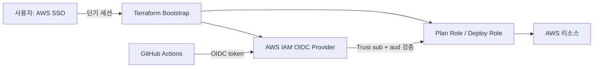

# AWS·GitHub 인증 트러블슈팅

> 상태: Identity Center 프로젝트 사용자·임시 Bootstrap 권한 연결 완료, Bootstrap Apply 부분 완료 및 권한 보완 대기
> 확인일: 2026-08-16  
> 저장소: `ekseh93/japan-korea-travel-route-composer`

이 문서는 이 프로젝트에서 AWS Console, 로컬 Terraform, GitHub Actions의 인증이
서로 다르게 동작해 발생한 문제와 해결 기준을 기록한다. 비밀번호, Access Key,
Secret Key, OTP와 같은 인증 정보를 문서나 GitHub에 기록하지 않는다.

## 결론

GitHub에 IAM 사용자 Access Key를 저장하지 않는다. GitHub Actions는 GitHub OIDC
토큰으로 AWS IAM Role을 짧게 Assume하고, AWS는 저장소·브랜치·Environment가 맞는지
Trust Policy로 확인한다.

사람이 최초 Bootstrap을 실행할 때만 AWS IAM Identity Center(SSO) 또는 승인된
단기 세션이 필요하다. Bootstrap이 OIDC Provider와 Plan/Deploy Role을 만든 뒤에는
CI가 사람의 AWS 키 없이 동작한다.

## 의견 충돌 및 결정 기록

이 프로젝트에서 보안·자동화 의견이 충돌할 때는 단순히 한쪽을 선택하지 않고,
위험과 운영 편의의 교환 관계를 설명한 뒤 결정과 근거를 기록한다. 같은 유형의
논의가 다시 발생하면 아래 결정과 변경 이력을 먼저 확인한다.

### 1. GitHub에 AWS IAM Access Key를 넣을 것인가

- **처음 제안한 방향:** GitHub 계정이나 Secret에 AWS 인증 정보를 넣으면 자동화가
  간단하고, 데스크톱 앱에서 관리하므로 문제가 적다는 의견이 있었다.
- **설명한 위험:** 장기 Access Key는 폐기 전까지 유효하고, 유출·잘못된 Secret 전달·
  회전 누락이 발생하면 저장소와 무관하게 계정 권한을 계속 사용할 수 있다. GitHub
  OIDC는 실행 때만 발급되는 토큰과 저장소·브랜치·Environment 조건을 사용한다.
- **납득한 기준:** 자동화 편의보다 자격 증명 수명과 유출 범위를 줄이는 것이 이
  프로젝트의 포트폴리오 보안 기준에 맞는다.
- **최종 결정:** 장기 Access Key를 GitHub, `.env`, 문서에 저장하지 않는다. GitHub
  Actions는 OIDC로 Plan/Deploy Role을 Assume한다.

### 2. 기존 K-Beauty 사용자를 재사용할 것인가

- **처음 제안한 방향:** 이미 있는 `kbeauty-dev` 사용자를 재사용하면 설정이 빠르다는
  의견이 있었다.
- **설명한 이유:** 프로젝트별 사용자 분리는 권한·감사·초대 메일·철회 범위를
  분리하고, 한 프로젝트의 권한 변경이 다른 포트폴리오에 전파되는 것을 막는다.
- **납득한 기준:** 추가 설정 한 번보다 프로젝트 경계와 철회 가능성이 중요하다.
- **최종 결정:** `kbeauty-dev`는 유지하고, 이 프로젝트에는
  `japan-korea-dev` (`yukihwana1@gmail.com`)를 별도로 사용한다.

### 3. 사람용 사용자에게 전체 권한을 줄 것인가

- **처음 제안한 방향:** 권한 오류를 반복해서 처리하지 않도록 새 프로젝트 사용자에
  AWS 전체 권한을 주자는 의견이 있었다.
- **설명한 위험:** 전체 권한은 실수나 잘못된 Terraform으로 모든 리소스와 IAM을
  생성·삭제할 수 있고, 비용 발생과 데이터 손실 범위도 계정 전체가 된다.
- **납득한 기준:** 최초 Bootstrap에 필요한 권한과 평상시 개발 권한을 분리하면
  자동화를 유지하면서도 임시 권한을 회수할 수 있다.
- **최종 결정:** 현재는 1시간 세션의 사용자 지정 `JapanKoreaBootstrap` 권한을
  연결했다. `AdministratorAccess`로 바꾸려면 별도 관리자 세션과 실행 시점의
  명시적 승인이 필요하며, 현재는 변경하지 않았다.

### 4. GitHub Actions OIDC Role에도 전체 권한을 줄 것인가

- **처음 제안한 방향:** CI에서도 권한 오류가 없도록 Plan/Deploy OIDC Role에
  `AdministratorAccess`를 주자는 의견이 있었다.
- **설명한 위험:** 해킹만이 아니라 잘못된 Terraform, 워크플로 오용, 의존성·Action
  공급망 변조, 신뢰된 PR의 실수만으로도 AWS 전체 리소스와 IAM을 조작할 수 있다.
  Fork 방어가 있어도 신뢰 저장소의 코드가 실행되는 위험은 남는다.
- **납득한 기준:** CI는 사람이 검토한 변경을 실행하는 경로이므로 필요한 서비스와
  Environment로 권한을 제한해야 하며, production은 보호 환경과 수동 승인을 유지해야 한다.
- **최종 결정:** Plan/Deploy Role은 승인된 최소 권한 정책을 유지한다. OIDC Trust를
  전체 저장소·전체 브랜치·와일드카드로 넓히지 않는다.

### 5. CloudShell 권한을 추가할 것인가

- **문제:** 브라우저에서 AWS 역할에 로그인했지만 CloudShell 환경 생성이 거부됐다.
- **설명한 이유:** 현재 Bootstrap 정책에는 Terraform이 실제로 요구하는 S3·IAM·STS
  작업만 있고 CloudShell 환경 생성 권한은 없다. CloudShell을 열기 위해 권한을
  넓히면 실행 도구 때문에 임시 권한의 범위가 불필요하게 커진다.
- **최종 결정:** CloudShell 오류를 이유로 권한을 넓히지 않는다. AWS CLI v2 SSO 또는
  승인된 단기 세션으로 로컬 Bootstrap을 실행하고, 필요한 경우 별도의 제한된
  실행 역할을 설계한 뒤 영향과 철회 방법을 검토한다.

### 6. 브라우저 로그인과 로컬 CLI 인증을 같은 것으로 볼 것인가

- **문제:** AWS Console에서는 로그인됐지만 PowerShell의 `aws sts get-caller-identity`
  는 자격 증명을 찾지 못했다.
- **설명한 이유:** Console 쿠키·역할 세션과 로컬 AWS CLI의 SSO 캐시는 별도 인증 경로다.
  브라우저 로그인 상태를 읽거나 비밀번호·OTP를 복사해 CLI에 넣는 방식은 구현하지 않는다.
- **최종 결정:** CLI v2 SSO 프로필과 `aws sso login`을 사용한다. CLI v1, 장기 키,
  브라우저 쿠키 복사는 해결책으로 인정하지 않는다.

### 7. 자동 진행과 외부 상태 변경 승인 범위

- **문제:** 사용자는 `ㄱ`으로 다음 단계를 계속 진행하길 원하지만, AWS 사용자·권한·
  리소스 생성과 Terraform Apply는 외부 계정 상태를 변경한다.
- **설명한 기준:** 최종 생성·할당·Apply 직전에는 대상, 권한 범위, 비용·삭제 영향을
  다시 표시해야 잘못된 계정이나 과도한 권한을 막을 수 있다. 비밀번호·OTP 입력은
  사용자만 수행한다.
- **최종 결정:** 계획·검증·문서화는 연속 진행하고, 외부 상태를 바꾸는 단계는 대상과
  영향이 명확히 제시된 뒤 사용자의 명시적 승인을 받은 경우에만 실행한다.

### 8. Bootstrap Apply 중 이미 존재한 OIDC Provider를 어떻게 처리할 것인가

- **문제:** 승인된 Apply에서 GitHub OIDC Provider 생성이 `EntityAlreadyExists`로
  중단됐다. 읽기 전용 확인 결과 URL, audience, thumbprint가 승인 설계와 일치했다.
- **설명한 기준:** 기존 Provider를 삭제하거나 중복 생성하면 GitHub Trust 경계와
  다른 프로젝트의 연동을 훼손할 수 있다. 일치하는 기존 리소스는 import로 Terraform
  state에 편입하고, 의도한 태그만 관리하는 편이 안전하다.
- **최종 결정:** `arn:aws:iam::490220201302:oidc-provider/token.actions.githubusercontent.com`
  을 Terraform state에 import하고 태그를 반영했다. Provider 삭제·교체는 하지 않았다.
- **검증 결과:** `sts.amazonaws.com` client ID와 승인된 thumbprint를 읽기 전용으로
  확인했고, Provider 태그 반영은 Apply에서 성공했다.

### 9. Bootstrap 역할에 Terraform 확인용 IAM 권한을 추가할 것인가

- **문제:** Apply가 생성 후 읽기 단계에서 `s3:GetBucketAcl`,
  `iam:ListAttachedRolePolicies`, `iam:GetRolePolicy` 부족으로 중단됐다. 이 과정에서
  State/Artifact Bucket 설정과 Plan/Deploy Role 생성은 완료됐고, 두 inline policy의
  AWS API 생성도 완료됐지만 Terraform state 확정만 실패했다.
- **설명한 위험:** 이 오류를 해결하려고 `AdministratorAccess`나 GitHub OIDC 전체 권한을
  부여하면 임시 Bootstrap의 범위가 계정 전체로 확대된다. 필요한 API 확인 권한만
  1시간 임시 permission set에 추가하면 같은 자동화 흐름을 유지하면서 범위를 제한할 수 있다.
- **최종 결정:** 관리자 세션에서 `JapanKoreaBootstrap`에 위 3개 action만 일시 추가하고,
  state import/refresh/검증을 끝낸 뒤 permission set에서 제거한다. CloudShell 권한,
  장기 Access Key, OIDC AdministratorAccess는 추가하지 않는다.
- **현재 차단:** 관리자 세션 로그인과 permission set 변경 전에는 Terraform Apply를
  재실행하지 않는다.

### 10. GitHub OIDC Plan Role AssumeRole이 거부된 이유

- **문제:** GitHub `Terraform Plan` workflow의 `Configure AWS OIDC`가
  `Not authorized to perform sts:AssumeRoleWithWebIdentity`로 실패했다.
- **확인 과정:** 기존 branch subject를 사용한 run `31923699672`와 Environment 이름만
  사용한 run `31923925034`가 모두 실패했다. 저장소 OIDC 설정 API의
  `use_immutable_subject=false`만 믿지 않고, 진단 workflow에서 토큰 자체의 비밀값은 출력하지
  않은 채 `sub`, `aud`, `environment`, repository ID만 확인했다.
- **원인:** 실제 `sub`는
  `repo:ekseh93@60168922/japan-korea-travel-route-composer@1334758912:environment:terraform-plan`였다.
  2026-08-15 생성 저장소의 immutable owner/repository ID 형식과 AWS Trust의 이름 기반 형식이
  불일치했다.
- **처리:** Plan Role Trust를 정확한 immutable subject로 변경하고, Deploy Role도 같은
  immutable prefix의 `production` Environment를 사용하도록 Terraform 입력 계약을 고정했다.
  branch·전체 repository wildcard로 권한을 넓히지 않았다. 진단 단계는 검증 후 workflow에서
  제거했다.
- **검증 결과:** 진단 포함 run `31924604384`에서 먼저 `Configure AWS OIDC`와 Terraform Plan이
  성공했고, 진단 단계를 제거한 최종 run `31924876346`에서도 두 단계가 모두 성공했다. Fork
  guard와 protected Environment 설정은 유지된다.

### 재발 시 기록 형식

새로운 의견 충돌은 다음 순서로 이 문서에 추가한다.

1. 문제와 사용자가 처음 원한 방향
2. 확인한 사실과 설명한 위험·비용·보안 영향
3. 사용자가 납득한 기준
4. 최종 결정, 적용 범위, 철회 방법
5. 실행·검증 결과와 남은 차단 요소

## 현재 AWS Identity Center 상태

- 계정: `490220201302` (`kthwan93@gmail.com`), 리전: `ap-northeast-1`
- 사용자: `japan-korea-dev` (`yukihwana1@gmail.com`)
- 연결된 임시 권한 세트: `JapanKoreaBootstrap` (세션 1시간, 사용자 지정 인라인 정책)
- Bootstrap 부분 Apply 결과: State Bucket과 Artifact Bucket 생성·보안 설정 완료, 기존 GitHub
  OIDC Provider import·태그 반영 완료, Plan/Deploy Role 생성 완료, 두 inline policy는 AWS
  생성 확인 후 Terraform state 확정 대기
- CloudShell은 임시 권한 세트의 최소 권한에 환경 생성 권한이 없어 사용할 수 없다. 로컬 실행은
  AWS CLI v2 SSO 또는 별도의 승인된 단기 세션이 필요하다.



## 왜 GitHub Secret Access Key를 쓰지 않는가

GitHub Secret에 `AWS_ACCESS_KEY_ID`와 `AWS_SECRET_ACCESS_KEY`를 저장하는 방식은
동작할 수 있지만 이 프로젝트의 보안·운영 기준과 맞지 않는다.

| 기준               | 장기 IAM Access Key                  | GitHub OIDC Role                        |
| ------------------ | ------------------------------------ | --------------------------------------- |
| 유효기간           | 폐기 전까지 지속                     | Workflow 실행 중인 단기 세션            |
| 유출 영향          | 키가 유효한 동안 계정 권한 사용 가능 | Trust 조건과 Role Policy 범위로 제한    |
| 회전               | 수동 교체·동기화 필요                | GitHub가 토큰을 매 실행 발급            |
| Fork 방어          | Secret 노출·권한 전달 실수 위험      | Workflow의 fork guard와 `sub` 조건 사용 |
| 이 프로젝트의 정책 | 금지                                 | 승인된 방식                             |

GitHub는 AWS OIDC를 사용하면 장기 AWS 자격 증명을 저장하지 않고 임시 권한을
사용할 수 있다고 설명한다. AWS도 OIDC Federation으로 필요한 권한만 가진 Role에
임시 자격 증명을 매핑하는 방식을 권장한다.

- [GitHub: Configuring OpenID Connect in AWS](https://docs.github.com/en/actions/how-tos/secure-your-work/security-harden-deployments/oidc-in-aws)
- [AWS: OIDC federation](https://docs.aws.amazon.com/IAM/latest/UserGuide/id_roles_providers_oidc.html)

## 왜 최초에는 사람용 AWS 인증이 필요한가

GitHub OIDC Role은 처음부터 존재하지 않는다. 최초 Bootstrap이 다음 리소스를
만들어야 하기 때문이다.

- Terraform State용 S3 Bucket
- Lambda Artifact용 versioned S3 Bucket
- GitHub OIDC Provider
- PR·`main`용 Plan Role
- 보호된 `production` Environment용 Deploy Role
- Budget 알림과 비용 제어 리소스

따라서 최초 1회는 AWS 계정 소유자 또는 승인된 운영자가 SSO로 AWS에 접근해야
한다. 이 세션은 GitHub에 저장하지 않고, Bootstrap이 끝나면 만료시킨다.

## 최초 실행 순서

AWS IAM Identity Center가 이미 설정된 경우 다음 명령을 실행한다. AWS CLI v2를
사용한다.

```powershell
aws configure sso --profile portfolio
aws sso login --profile portfolio
$env:AWS_PROFILE = "portfolio"
$env:AWS_REGION = "ap-northeast-1"
aws sts get-caller-identity
```

`sts get-caller-identity`가 성공한 뒤에만 다음 순서로 진행한다.

1. Account ID, Region, 결제 플랜과 Budget 수신 주소를 확인한다.
2. `infra/bootstrap`의 backend 없는 Terraform Plan을 생성한다.
3. State Bucket, OIDC Provider, Plan/Deploy Role, Budget만 포함되는지 검토한다.
4. 승인된 Plan만 Apply한다.
5. Bootstrap Output으로 GitHub Repository Variables와 Protected Environment를 구성한다.
6. 신뢰 PR에서 Plan Role, 보호된 `production`에서 Deploy Role을 각각 확인한다.

AWS Console 브라우저 로그인만으로는 PowerShell의 `AWS_PROFILE`이나 셸 자격
증명이 생성되지 않는다. Console과 로컬 CLI는 같은 AWS 계정을 보더라도 별도의
인증 경로다.

## Bootstrap 이후 GitHub 설정

다음 값은 Access Key가 아니라 Role·Bucket 식별자와 일반 설정값이다.

### Repository Variables

- `AWS_REGION`
- `PROJECT_SLUG`
- `TERRAFORM_STATE_BUCKET`
- `LAMBDA_ARTIFACT_BUCKET`
- `TERRAFORM_PLAN_ROLE_ARN`
- `TERRAFORM_DEPLOY_ROLE_ARN`

Artifact가 생성된 뒤에는 `LAMBDA_ARTIFACT_KEY`와
`LAMBDA_SOURCE_CODE_HASH`도 Workflow가 검증할 수 있도록 연결한다.

### Secret

- `BUDGET_EMAIL`만 Secret으로 취급한다.

### Protected Environment

- `terraform-plan`: Plan Role Trust와 연결
- `production`: 수동 승인 후 Deploy Role 사용
- `production-teardown`: `DESTROY-PRODUCTION` 확인과 별도 보호 사용

Workflow는 Fork Repository에서 AWS OIDC 권한을 사용하지 않으며,
`production` Deploy Role은
`repo:ekseh93@60168922/japan-korea-travel-route-composer@1334758912:environment:production`
조건을 사용하도록 Terraform 입력 계약으로 고정한다. GitHub Repository OIDC 설정 API의
`use_immutable_subject=false` 값만으로 Trust 형식을 추정하지 않고, 실제 발급 token의 `sub`를
검증한 결과를 우선한다.

## 실제로 발생한 문제와 확인 결과

| 증상                                                      | 원인                                           | 처리·현재 상태                                                            |
| --------------------------------------------------------- | ---------------------------------------------- | ------------------------------------------------------------------------- |
| AWS Console은 열리지만 `aws sts get-caller-identity` 실패 | 브라우저 세션과 PowerShell 자격 증명은 별도    | SSO Profile을 별도로 설정해야 함                                          |
| `Unable to locate credentials`                            | AWS Profile, 환경변수, credentials 파일이 없음 | 실제 계정 호출·Plan·Apply를 실행하지 않음                                 |
| `aws`, `terraform`, `tflint` 명령이 없음                  | 로컬 개발 도구가 설치되지 않음                 | Terraform 1.15.8, TFLint 0.64.0을 사용자 영역에 설치하고 정적 검증 완료    |
| `aws sso login`이 동작하지 않음                           | AWS CLI v1에는 CLI v2의 SSO 로그인 명령이 없음 | AWS CLI v2 또는 승인된 단기 세션을 준비해야 하며 장기 Access Key로 우회하지 않음 |
| GitHub CI는 통과하지만 AWS Plan이 없음                    | CI 정적 검증은 AWS 계정 호출을 하지 않음       | OIDC Role·Repository Variables·Environment가 아직 미구성                  |
| CloudShell이 AWS Sign-In으로 이동                         | 브라우저 자동화 세션에 AWS 로그인 정보가 없음  | 비밀번호·OTP를 대신 입력하거나 우회하지 않음                              |
| GitHub에 IAM을 넣어야 하는가                              | OIDC와 장기 Access Key 방식의 혼동             | Access Key는 저장하지 않고 OIDC Role을 사용                               |
| Bootstrap Apply의 S3 `GetBucketAcl` 거부                  | 임시 역할에 Terraform의 버킷 read 권한이 없음  | 버킷을 재생성하지 않고 최소 read action 보완 대기                           |
| IAM 역할 생성 후 `ListAttachedRolePolicies`/`GetRolePolicy` 거부 | 생성 후 provider 확인 action 부족          | 역할과 정책은 유지하고 최소 확인 action 보완 후 state 확정                 |

## 검증 증거

- 저장소 `main` 최신 구현 커밋: `c747558`
- GitHub CI: [31921517514](https://github.com/ekseh93/japan-korea-travel-route-composer/actions/runs/31921517514)
- 로컬 Terraform `fmt -check`, `init -backend=false`, `validate`: 두 루트 통과
- 로컬 TFLint `0.64.0`: `infra` 재귀 검사 통과
- AWS Account ID 조회: `490220201302` 확인
- AWS Identity Center 사용자·임시 Bootstrap 권한 할당: 완료
- AWS Console의 `JapanKoreaBootstrap/japan-korea-dev` 역할 진입: 확인
- CloudShell 환경 생성: 최소 권한 부족으로 미실행
- AWS OIDC Provider: 기존 Provider 일치 여부 확인, Terraform import·태그 Apply 완료
- Terraform Bootstrap Plan: 최초 `16 add` 확인, 복구 Plan `13 add / 1 change` 확인
- Terraform Bootstrap Apply: 부분 완료; Bucket 보안 설정·OIDC·Plan/Deploy Role 완료,
  inline policy 생성 후 state read-back 권한에서 중단
- AWS OIDC AssumeRole: immutable subject Trust로 수정, 최종 run `31924876346`에서 OIDC와 Terraform Plan 성공
- AWS 리소스·배포 Smoke: 미실행

### 11. 문서에 있던 GitHub Environment 보호 규칙이 실제로 없었던 이유

- **문제:** 문서는 `production` 수동 승인과 `production-teardown` 별도 보호를 요구했지만,
  GitHub API 확인 당시 실제 Environment는 `terraform-plan` 하나뿐이고 보호 규칙도 없었다.
- **결정:** 단일 관리자 저장소의 자동화 흐름을 막지 않도록 `terraform-plan`은 승인 없이 유지하고,
  `production`과 `production-teardown`에는 `ekseh93` 필수 승인자와 `main` branch 제한을 추가했다.
  self-review는 유일한 관리자 승인자가 없는 상태에서 영구 차단되지 않도록 허용했다.
- **검증:** 두 Environment에 required reviewer와 branch policy가 생성된 것을 GitHub API로 확인했다.
  이 설정은 Production Apply나 teardown을 실행한 증거가 아니며, 실제 workflow는 승인 대기 게이트를 거친다.

### 12. 보호된 Production Build Gate가 fixture를 검증한 이유

- **문제:** 수동으로 실행한 Production Build Gate `31925333862`가 실제
  `data/catalog-v1`가 아니라 기본 `packages/test-fixtures`를 Production catalog로
  검증해 실패했다. AWS OIDC·artifact 업로드·Terraform 단계에는 도달하지 않았다.
- **원인:** `deploy-production.yml`의 `catalog:validate`와 `catalog:build` 호출에
  production catalog root인 `data/catalog-v1` 인자가 빠져 CLI 기본값이 사용됐다.
- **처리:** 두 호출 모두 `--root data/catalog-v1`를 명시해 local command와 CI
  command의 입력 경로를 일치시켰다. fixture는 계약 테스트 전용으로 유지한다.
- **검증 기준:** 수정 후 workflow contract test와 Production Build Gate를 다시 실행하고,
  Build 성공 뒤 `production` 승인 단계에 도달하는지 확인한다. Budget 이메일 승인 전에는
  해당 승인이나 AWS Apply를 진행하지 않는다.

### 13. Production package 단계에서 pnpm workspace deploy가 거부된 이유

- **문제:** catalog root 수정 후 Production Build Gate `31925626381`은
  `Install and verify`까지 통과했지만 `Package immutable release`의
  `pnpm deploy --prod`에서 실패했다. AWS 단계에는 도달하지 않았다.
- **원인:** pnpm 11은 workspace package를 deploy할 때 기본적으로
  `inject-workspace-packages=true`를 요구한다. 현재 monorepo는 injected dependency
  방식으로 설계되지 않아 pnpm이 명시적으로 legacy deploy를 요구했다.
- **처리:** workflow의 API package deploy에 pnpm이 안내한 `--legacy`를 추가했다.
  로컬 `pnpm --filter @route-composer/api deploy --prod --legacy`가 성공하는 것을 확인했다.
- **검증 결과:** workflow contract test와 Production Build Gate `31925830262`에서
  catalog validate, package, checksum, SBOM, GitHub artifact upload가 모두 성공했다.
  Deploy job은 `production` 보호 승인 대기에서 취소했으며 AWS OIDC·Terraform Apply와
  실제 AWS artifact upload에는 도달하지 않았다.

### 14. Budget 이메일 미승인 상태를 Terraform 입력에서도 차단하는 이유

- **문제:** GitHub `BUDGET_EMAIL` Secret이 아직 승인·설정되지 않았는데 Deploy workflow가
  빈 문자열을 Terraform 변수로 전달하면, 실패 시점이 SNS subscription Apply까지 늦어질 수 있다.
- **결정:** `budget_email`에 이메일 형식 validation을 추가해 빈 값·형식 오류를 Terraform
  입력 단계에서 즉시 거부한다. 이는 이메일을 자동 승인하거나 Secret을 생성하는 동작이 아니다.
- **검증:** Terraform contract test에 validation 문구를 고정하고, 승인 전에는 Secret 생성·AWS
  Apply를 실행하지 않는다.

### 15. 미승인 Budget Secret으로 Terraform Plan이 중단된 결과

- **실행:** 수동 Terraform Plan `31927331676`에서 `terraform-plan` OIDC Role AssumeRole과
  remote state init까지 성공했다.
- **결과:** 빈 `BUDGET_EMAIL`이 `Invalid value for variable` validation error를 발생시켜
  Plan이 종료됐다. workflow에는 Apply·artifact upload·배포 단계가 없으므로 AWS 리소스 변경은
  발생하지 않았다.
- **판정:** Budget 이메일 승인 전에는 이 실패가 정상적인 안전 차단이다. 승인된 이메일과 필요한
  immutable artifact 입력이 준비된 뒤에만 Plan 결과를 검토하고 Production Apply로 진행한다.

### 16. Budget 사전검사를 OIDC 앞에 둔 이유

- **문제:** Plan `31927331676`은 빈 `BUDGET_EMAIL`로 최종 validation에 실패했지만, 그 전에
  OIDC AssumeRole과 remote state init을 수행했다.
- **결정:** `terraform-plan.yml`과 `deploy-production.yml`에 Secret 비어 있음 검사를
  OIDC 단계 앞에 추가했다. 승인되지 않은 Budget 입력이면 AWS Role을 요청하지 않고 즉시 종료한다.
- **검증:** workflow contract test가 두 workflow의 사전검사와 오류 메시지를 고정한다.
  재실행 Plan `31928188767`은 사전검사에서 실패했고 `Configure AWS OIDC`와 Terraform plan이
  모두 skipped 됐다. Secret이 승인·설정되기 전에는 새 Plan·Deploy를 실행하지 않는다.

Plan workflow는 같은 사전검사에서 `LAMBDA_ARTIFACT_KEY`와
`LAMBDA_SOURCE_CODE_HASH`도 요구한다. Build once Artifact가 없거나 checksum이 연결되지 않은
상태로 Production Plan을 만들지 않는다.

### 17. Lambda source hash가 ZIP과 실제로 일치하는지 검증하지 않던 문제

- **문제:** Release verifier가 `lambda-source-code-hash.txt`의 Base64 형식만 확인해, 다른
  Lambda ZIP의 해시를 metadata에 넣어도 통과할 수 있었다.
- **결정:** verifier가 배포 패키지 `lambda.zip`의 SHA-256을 직접 계산해 Base64 metadata와
  비교하도록 변경했다. 형식 검사는 일치 검사를 대신하지 않는다.
- **검증:** Release 계약 테스트에 해시 불일치 실패 케이스를 추가했고, 5개 테스트가 모두 통과했다.
  이 검사는 AWS 호출 없이 Build once Artifact 연결 오류를 배포 전에 차단한다.

### 18. Lambda Terraform 입력값이 비어 있지 않기만 하면 통과하던 문제

- **문제:** `LAMBDA_ARTIFACT_KEY`와 `LAMBDA_SOURCE_CODE_HASH`가 임의의 비어 있지 않은 문자열이어도
  Terraform 단계까지 진행할 수 있었다.
- **결정:** Artifact key는 `40자리 Release SHA/lambda.zip`, source hash는 32-byte SHA-256
  Base64 형식으로 고정하고, Terraform 변수와 AWS OIDC 전 Plan 사전검사에 같은 경계를 추가했다.
- **검증:** Terraform 계약 4건과 Workflow 계약 5건이 형식·오류 메시지를 검증했다. 값이 없거나
  형식이 잘못된 상태에서는 AWS Role을 요청하지 않는다.

## 하지 않는 해결 방법

- IAM 사용자 Access Key를 GitHub Secret, `.env`, README, Terraform 변수 파일에 저장하지 않는다.
- AWS Console 로그인 쿠키·비밀번호·OTP를 복사하거나 자동화하지 않는다.
- OIDC Trust 조건을 `*`로 넓히지 않는다.
- Fork PR에 AWS Token·Secret·Deploy Role을 제공하지 않는다.
- 인증 오류를 해결하기 위해 장기 키로 우회하지 않는다.

관련 실행 절차는 [RUNBOOK](RUNBOOK.md), IAM/OIDC 설계는
[Terraform 설계](TERRAFORM.md)와 [CI/CD 설계](../07-delivery/CI_CD.md)에 둔다.
