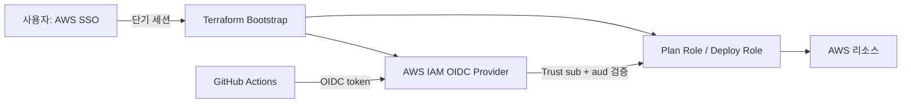

# AWS·GitHub 인증 트러블슈팅

> 상태: 인증 설계·Workflow 정적 검증 완료, 실제 AWS AssumeRole·Plan·Apply 미실행  
> 확인일: 2026-08-16  
> 저장소: `ekseh93/japan-korea-travel-route-composer`

이 문서는 이 프로젝트에서 AWS Console, 로컬 Terraform, GitHub Actions의 인증이
서로 다르게 동작해 발생한 문제와 해결 기준을 기록한다. 비밀번호, Access Key,
Secret Key, OTP와 같은 인증 정보를 문서나 GitHub에 기록하지 않는다.

## 결론

GitHub에 IAM 사용자 Access Key를 저장하지 않는다. GitHub Actions는 GitHub OIDC
토큰으로 AWS IAM Role을 짧게 Assume하고, AWS는 저장소·브랜치·Environment가 맞는지
Trust Policy로 확인한다.

사람이 최초 Bootstrap을 실행할 때만 AWS IAM Identity Center(SSO) 또는 승인된
단기 세션이 필요하다. Bootstrap이 OIDC Provider와 Plan/Deploy Role을 만든 뒤에는
CI가 사람의 AWS 키 없이 동작한다.



## 왜 GitHub Secret Access Key를 쓰지 않는가

GitHub Secret에 `AWS_ACCESS_KEY_ID`와 `AWS_SECRET_ACCESS_KEY`를 저장하는 방식은
동작할 수 있지만 이 프로젝트의 보안·운영 기준과 맞지 않는다.

| 기준               | 장기 IAM Access Key                  | GitHub OIDC Role                        |
| ------------------ | ------------------------------------ | --------------------------------------- |
| 유효기간           | 폐기 전까지 지속                     | Workflow 실행 중인 단기 세션            |
| 유출 영향          | 키가 유효한 동안 계정 권한 사용 가능 | Trust 조건과 Role Policy 범위로 제한    |
| 회전               | 수동 교체·동기화 필요                | GitHub가 토큰을 매 실행 발급            |
| Fork 방어          | Secret 노출·권한 전달 실수 위험      | Workflow의 fork guard와 `sub` 조건 사용 |
| 이 프로젝트의 정책 | 금지                                 | 승인된 방식                             |

GitHub는 AWS OIDC를 사용하면 장기 AWS 자격 증명을 저장하지 않고 임시 권한을
사용할 수 있다고 설명한다. AWS도 OIDC Federation으로 필요한 권한만 가진 Role에
임시 자격 증명을 매핑하는 방식을 권장한다.

- [GitHub: Configuring OpenID Connect in AWS](https://docs.github.com/en/actions/how-tos/secure-your-work/security-harden-deployments/oidc-in-aws)
- [AWS: OIDC federation](https://docs.aws.amazon.com/IAM/latest/UserGuide/id_roles_providers_oidc.html)

## 왜 최초에는 사람용 AWS 인증이 필요한가

GitHub OIDC Role은 처음부터 존재하지 않는다. 최초 Bootstrap이 다음 리소스를
만들어야 하기 때문이다.

- Terraform State용 S3 Bucket
- Lambda Artifact용 versioned S3 Bucket
- GitHub OIDC Provider
- PR·`main`용 Plan Role
- 보호된 `production` Environment용 Deploy Role
- Budget 알림과 비용 제어 리소스

따라서 최초 1회는 AWS 계정 소유자 또는 승인된 운영자가 SSO로 AWS에 접근해야
한다. 이 세션은 GitHub에 저장하지 않고, Bootstrap이 끝나면 만료시킨다.

## 최초 실행 순서

AWS IAM Identity Center가 이미 설정된 경우 다음 명령을 실행한다. AWS CLI v2를
사용한다.

```powershell
aws configure sso --profile portfolio
aws sso login --profile portfolio
$env:AWS_PROFILE = "portfolio"
$env:AWS_REGION = "ap-northeast-1"
aws sts get-caller-identity
```

`sts get-caller-identity`가 성공한 뒤에만 다음 순서로 진행한다.

1. Account ID, Region, 결제 플랜과 Budget 수신 주소를 확인한다.
2. `infra/bootstrap`의 backend 없는 Terraform Plan을 생성한다.
3. State Bucket, OIDC Provider, Plan/Deploy Role, Budget만 포함되는지 검토한다.
4. 승인된 Plan만 Apply한다.
5. Bootstrap Output으로 GitHub Repository Variables와 Protected Environment를 구성한다.
6. 신뢰 PR에서 Plan Role, 보호된 `production`에서 Deploy Role을 각각 확인한다.

AWS Console 브라우저 로그인만으로는 PowerShell의 `AWS_PROFILE`이나 셸 자격
증명이 생성되지 않는다. Console과 로컬 CLI는 같은 AWS 계정을 보더라도 별도의
인증 경로다.

## Bootstrap 이후 GitHub 설정

다음 값은 Access Key가 아니라 Role·Bucket 식별자와 일반 설정값이다.

### Repository Variables

- `AWS_REGION`
- `PROJECT_SLUG`
- `TERRAFORM_STATE_BUCKET`
- `LAMBDA_ARTIFACT_BUCKET`
- `TERRAFORM_PLAN_ROLE_ARN`
- `TERRAFORM_DEPLOY_ROLE_ARN`

Artifact가 생성된 뒤에는 `LAMBDA_ARTIFACT_KEY`와
`LAMBDA_SOURCE_CODE_HASH`도 Workflow가 검증할 수 있도록 연결한다.

### Secret

- `BUDGET_EMAIL`만 Secret으로 취급한다.

### Protected Environment

- `terraform-plan`: Plan Role Trust와 연결
- `production`: 수동 승인 후 Deploy Role 사용
- `production-teardown`: `DESTROY-PRODUCTION` 확인과 별도 보호 사용

Workflow는 Fork Repository에서 AWS OIDC 권한을 사용하지 않으며,
`production` Deploy Role은 `repo:ekseh93/japan-korea-travel-route-composer:environment:production`
조건을 사용한다. 현재 GitHub Repository OIDC 설정은 `use_immutable_subject=false`로
확인되었고, 현재 Terraform의 `repo:owner/name` 형식 Trust와 일치한다.

## 실제로 발생한 문제와 확인 결과

| 증상                                                      | 원인                                           | 처리·현재 상태                                                            |
| --------------------------------------------------------- | ---------------------------------------------- | ------------------------------------------------------------------------- |
| AWS Console은 열리지만 `aws sts get-caller-identity` 실패 | 브라우저 세션과 PowerShell 자격 증명은 별도    | SSO Profile을 별도로 설정해야 함                                          |
| `Unable to locate credentials`                            | AWS Profile, 환경변수, credentials 파일이 없음 | 실제 계정 호출·Plan·Apply를 실행하지 않음                                 |
| `aws`, `terraform`, `tflint` 명령이 없음                  | 로컬 개발 도구가 설치되지 않음                 | Terraform 1.9.8, TFLint 0.64.0을 사용자 영역에 설치하고 정적 검증 완료    |
| AWS CLI 표준 설치가 권한 부족으로 실패                    | 비관리자 PowerShell에서 시스템 설치 시도       | 로컬 정적 확인에는 AWS CLI 1.46.0을 준비했지만 운영 SSO에는 CLI v2를 권장 |
| GitHub CI는 통과하지만 AWS Plan이 없음                    | CI 정적 검증은 AWS 계정 호출을 하지 않음       | OIDC Role·Repository Variables·Environment가 아직 미구성                  |
| CloudShell이 AWS Sign-In으로 이동                         | 브라우저 자동화 세션에 AWS 로그인 정보가 없음  | 비밀번호·OTP를 대신 입력하거나 우회하지 않음                              |
| GitHub에 IAM을 넣어야 하는가                              | OIDC와 장기 Access Key 방식의 혼동             | Access Key는 저장하지 않고 OIDC Role을 사용                               |

## 검증 증거

- 저장소 `main` 최신 구현 커밋: `dac87cc`
- GitHub CI: [31916777514](https://github.com/ekseh93/japan-korea-travel-route-composer/actions/runs/31916777514)
- 로컬 Terraform `fmt -check`, `init -backend=false`, `validate`: 두 루트 통과
- 로컬 TFLint `0.64.0`: `infra` 재귀 검사 통과
- AWS Account ID 조회: 미실행
- AWS OIDC AssumeRole: 미실행
- Terraform Plan/Apply: 미실행
- AWS 리소스·배포 Smoke: 미실행

## 하지 않는 해결 방법

- IAM 사용자 Access Key를 GitHub Secret, `.env`, README, Terraform 변수 파일에 저장하지 않는다.
- AWS Console 로그인 쿠키·비밀번호·OTP를 복사하거나 자동화하지 않는다.
- OIDC Trust 조건을 `*`로 넓히지 않는다.
- Fork PR에 AWS Token·Secret·Deploy Role을 제공하지 않는다.
- 인증 오류를 해결하기 위해 장기 키로 우회하지 않는다.

관련 실행 절차는 [RUNBOOK](RUNBOOK.md), IAM/OIDC 설계는
[Terraform 설계](TERRAFORM.md)와 [CI/CD 설계](../07-delivery/CI_CD.md)에 둔다.
